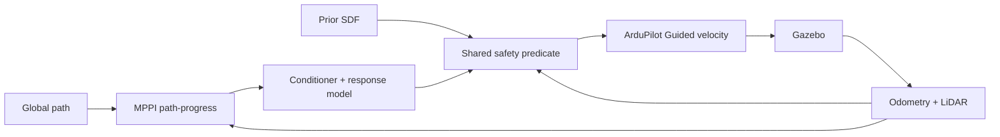

# MPPI UAV Navigation with ArduPilot and Gazebo

Project nghiên cứu điều khiển UAV tránh vật cản bằng **Model Predictive Path
Integral (MPPI)** trên **ArduPilot SITL + Gazebo Harmonic**. Bài thử chính cho
UAV lấy đà 60 m, đạt cruise request 5 hoặc 10 m/s, tự giảm tốc để qua các góc
cua trong bãi container rồi tăng tốc lại.

Đây là phần mở rộng nghiên cứu trên nền
[`ArduPilot/ardupilot_gazebo`](https://github.com/ArduPilot/ardupilot_gazebo).
MPPI chạy trên companion side, gửi velocity/yaw-rate setpoint cho ArduPilot;
ArduPilot điều khiển UAV trong Gazebo.

## Kiến trúc hệ thống

**Trạng thái: M6 integration checkpoint.** A*, trajectory safety, command
conditioning và MPPI đã nằm trong core C++ thuần. ROS 2 nodes đã chạy global
planning, local MPPI, safety, diagnostics và RViz visualization trong một
launch. C++ autopilot adapter dùng MAVROS cho frame conversion và MAVLink; đường
runtime điều khiển không còn Python. Closed loop Gazebo/ArduPilot SITL đã đi từ
takeoff tới goal. Python chỉ còn là regression oracle cho thuật toán cũ.

Tài liệu thiết kế chính là
[`docs/ARCHITECTURE.md`](docs/ARCHITECTURE.md), bao gồm trách nhiệm module,
core interfaces, ROS topic contracts, quy ước frame, QoS, quyền sở hữu tham số,
ranh giới simulation/hardware, xử lý lỗi, thiết kế RViz và chiến lược test.
Các boundary và quyền sở hữu này cho phép developer khác tiếp quản từng module
mà không phải phụ thuộc vào workflow thí nghiệm cũ.

Dependency chỉ đi theo một chiều:

```text
uav_navigation_bringup
        |
        v
uav_navigation_ros
        |
        v
uav_navigation_core
```

### `uav_navigation_core`

[`uav_navigation_core/`](uav_navigation_core/) sở hữu planning algorithms,
trajectory/safety logic và reusable data structures. Public API/header của core
không chứa ROS messages, Gazebo APIs hoặc MAVLink APIs để cùng thuật toán có thể
dùng trong simulation và sau này trên edge device. Package build độc lập bằng
CMake hoặc trong ROS 2 bằng `ament_cmake`, và export shared library cùng headers.

Ranh giới này là quyết định riêng của project, dựa trên nhu cầu portability và
maintainability. Nó phù hợp với động lực chung của ROS 2 về phần mềm robot
modular, scalable và reusable được trình bày bởi Macenski và cộng sự trong
[“Robot Operating System 2: Design, architecture, and uses in the wild”](https://doi.org/10.1126/scirobotics.abm6074),
nhưng paper không quy định cấu trúc ba package cụ thể này.

### `uav_navigation_ros`

[`uav_navigation_ros/`](uav_navigation_ros/) sở hữu ROS 2 nodes,
topic/service/action communication, chuyển đổi ROS message ↔ core type và các
adapter riêng cho simulation hoặc hardware. Thuật toán vì vậy không trực tiếp
sở hữu kết nối simulator.

Nav2 là tham chiếu kiến trúc cho cách tách planning, control, environmental
representation và integration thành các server/plugin có interface rõ ràng;
project này không implement hoặc kế thừa Nav2. Xem
[Nav2 Navigation Servers](https://docs.nav2.org/jazzy/getting_started/navigation_concepts/navigation_servers/),
[Nav2 Navigation Plugins](https://docs.nav2.org/jazzy/configuration_and_development/navigation_plugins/)
và paper gốc
[“The Marathon 2: A Navigation System”](https://doi.org/10.1109/IROS45743.2020.9341207).

### `uav_navigation_bringup`

[`uav_navigation_bringup/`](uav_navigation_bringup/) sở hữu launch files, ROS
2 parameter YAML, RViz configuration, simulation bringup và hardware bringup
tương lai. System orchestration thuộc lớp này thay vì được mã hóa thành một
chuỗi terminal thủ công. ROS 2 launch được thiết kế để mô tả, cấu hình và khởi
động hệ thống gồm nhiều executable/node; cách tổ chức package theo tài liệu
[ROS 2 Jazzy: Integrating launch files into ROS 2 packages](https://docs.ros.org/en/jazzy/Tutorials/Intermediate/Launch/Launch-system.html).

Luồng hệ thống được thiết kế như sau:

```text
Sensors / State Estimation
          |
          v
     Map / Costmap
          |
          v
    Global Planner
          |
          v
      Global Path
          |
          v
     Local Planner
          |
          v
    Safety Checking
          |
          v
 Command Conditioning
          |
          v
   Autopilot Adapter
          |
          v
       ArduPilot
```

Các boundary tách environmental representation, global planning, local
control, safety và autopilot integration. Cách phân rã planner/controller/map
được tham khảo từ Nav2 Navigation Servers và *The Marathon 2*, nhưng data model
và flight-control semantics ở đây được thiết kế cho UAV.

Simulation và hardware dùng chung navigation core; chỉ adapter thay đổi:

```text
Gazebo / simulated sensors ----\
                                > Navigation Core
Real sensors / localization ---/
```

Autopilot adapter cô lập transport và flight-controller interface khỏi planner.
Đây cũng là điểm thay thế giữa SITL và flight controller thật. Thiết kế này dựa
trên interface boundary mà tài liệu chính thức
[ArduPilot ROS 2 Interfaces](https://ardupilot.org/dev/docs/ros2-interfaces.html)
mô tả cho state, odometry và vehicle services; README không coi hardware
deployment là đã hoàn tất.

### Environmental representation và costmap

Map/cost representation là input riêng cho planner thay vì nằm trong thuật
toán hoặc simulator adapter. Grid costmap biểu diễn free space, occupied space,
vùng inflated/high-cost và obstacle information từ sensor; planner có thể dùng
representation này để kiểm collision hoặc tránh vùng có cost cao. Cách phân
tách này được tham khảo từ
[Nav2 Costmap 2D](https://docs.nav2.org/jazzy/configuration_and_development/configuration_guide/core_servers/costmap_2d/),
nơi static, obstacle và inflation layers cung cấp environmental representation
cho planner/controller. Project chỉ dùng đây như tham chiếu; UAV có thể cần
adapter 2.5D/3D thay vì sao chép trực tiếp costmap 2D của Nav2.

### Config, launch và RViz

Algorithm và runtime parameters được tập trung trong
[`uav_navigation_bringup/config/navigation.yaml`](uav_navigation_bringup/config/navigation.yaml),
với mỗi nhóm tham số có module sở hữu rõ ràng, thay vì nằm rải rác trong lệnh
terminal hoặc hard-code trong script.

Workflow hướng tới dùng ROS 2 launch để phối hợp các thành phần:

- [`sim.launch.xml`](uav_navigation_bringup/launch/sim.launch.xml) dành cho tích
  hợp phía Gazebo/simulation;
- [`hardware.launch.xml`](uav_navigation_bringup/launch/hardware.launch.xml)
  dành cho sensor thật và edge device trong tương lai.

`sim.launch.xml` hiện là entry point M6 cho Gazebo, bridges, C++ planners và
RViz. `hardware.launch.xml` mới chỉ là boundary dự kiến và chưa sẵn sàng flight.

Thiết kế visualization gồm global costmap, global path, local predicted
trajectory, MPPI candidate/sample trajectory hoặc cost, obstacle và chọn goal
tương tác từ RViz. Mục tiêu là quan sát được dữ liệu cost mà global planner sử
dụng và debug quyết định của planner. Cấu hình nằm tại
[`uav_navigation_bringup/rviz/navigation.rviz`](uav_navigation_bringup/rviz/navigation.rviz).

### Nguồn tham khảo kiến trúc

- S. Macenski et al.,
  [“Robot Operating System 2: Design, architecture, and uses in the wild,”](https://doi.org/10.1126/scirobotics.abm6074)
  *Science Robotics*, 2022.
- S. Macenski et al.,
  [“The Marathon 2: A Navigation System,”](https://doi.org/10.1109/IROS45743.2020.9341207)
  IEEE/RSJ IROS, 2020.
- [ROS 2 Jazzy launch documentation](https://docs.ros.org/en/jazzy/Tutorials/Intermediate/Launch/Launch-system.html).
- [Nav2 Navigation Servers](https://docs.nav2.org/jazzy/getting_started/navigation_concepts/navigation_servers/),
  [Navigation Plugins](https://docs.nav2.org/jazzy/configuration_and_development/navigation_plugins/)
  và [Costmap 2D](https://docs.nav2.org/jazzy/configuration_and_development/configuration_guide/core_servers/costmap_2d/).
- [ArduPilot ROS 2 Interfaces](https://ardupilot.org/dev/docs/ros2-interfaces.html)
  và upstream [ArduPilot ROS integration](https://github.com/ArduPilot/ardupilot_ros).

## Open-source Design References

Các project dưới đây được nghiên cứu như **design references**. Chúng cung cấp
ví dụ thực tế về cách chia module, interface và integration boundary; project
này không sao chép code, không implement các stack đó và không coi kiến trúc
của chúng là template một-một.

| Reference | Ý tưởng kiến trúc được nghiên cứu |
|---|---|
| [SUPER](https://github.com/hku-mars/SUPER) | Tách map, planner, mission/RViz workflow và simulation tooling cho UAV |
| [MRS UAV System](https://github.com/ctu-mrs/mrs_uav_system) | Tổ chức UAV stack quy mô lớn, hardware abstraction và real deployment |
| [Aerostack2](https://github.com/aerostack2/aerostack2) | ROS 2 UAV modularity, platform independence và simulation-to-real reuse |
| [Navigation2](https://github.com/ros-navigation/navigation2) | Core interfaces, planner/controller split, costmap, safety, bringup và tổ chức MPPI |
| [Fast-Planner](https://github.com/HKUST-Aerial-Robotics/Fast-Planner) | Pipeline 3D map → search → trajectory và ESDF |
| [EGO-Planner](https://github.com/ZJU-FAST-Lab/ego-planner) | Onboard planning gọn nhẹ và không khóa planner vào ESDF |
| [MAVROS](https://github.com/mavlink/mavros) | Boundary ROS 2 ↔ MAVLink ↔ flight controller |
| [nvblox](https://github.com/nvidia-isaac/nvblox) | Mapping TSDF/ESDF tăng tốc GPU như một subsystem độc lập |

### SUPER

[SUPER](https://github.com/hku-mars/SUPER) là tham chiếu gần nhất về bài toán
UAV high-speed navigation. Cấu trúc upstream tách `rog_map`, `super_planner`,
`mission_planner` và `mars_uav_sim`; click demo cũng nhận goal qua RViz. Project
này nghiên cứu cách phân trách nhiệm đó theo ánh xạ khái niệm:

```text
SUPER                         This project
rog_map                  ->   map / collision environment
super_planner            ->   planning layer
mission_planner          ->   goal / mission interface
simulation components    ->   ROS / Gazebo adapters
```

SUPER hỗ trợ quyết định để planner nhận environmental representation qua
interface thay vì tự đọc Gazebo/SDF; click demo là ví dụ trực tiếp cho goal input
qua RViz. Project mở rộng observability contract này cho path, environment và
cost. Đây là tham chiếu planning và system integration cho UAV, không phải kiến
trúc được sao chép. Xem thêm paper gốc
[“Safety-assured high-speed navigation for MAVs”](https://doi.org/10.1126/scirobotics.ado6187).

### MRS UAV System

[MRS UAV System](https://github.com/ctu-mrs/mrs_uav_system) là tham chiếu cho
system-level modularity và deployment thật. Upstream tổ chức control, state
estimation, mapping và planning thành nhiều package, chạy onboard companion
computer và hỗ trợ cả realistic simulation lẫn real-world experiments. Điều
này củng cố boundary `Navigation Core → ROS/Hardware Adapter → Flight
Controller`: autonomy logic không nên phụ thuộc trực tiếp một flight-controller
API. Tham khảo thêm paper hệ thống
[“The MRS UAV System”](https://doi.org/10.1007/s10846-021-01383-5).

### Aerostack2

[Aerostack2](https://github.com/aerostack2/aerostack2) là ROS 2 UAV framework
được dùng làm tham chiếu cho modular package boundaries, platform independence,
launch/config organization và simulation-to-real reuse. Cách upstream tách
core, aerial platforms, hardware drivers, map server, motion controller,
simulation assets và user interfaces hỗ trợ mục tiêu dùng chung
`uav_navigation_core` trong khi thay adapter theo platform. Paper gốc mô tả
modular plugin architecture và validation trên simulation lẫn real flights:
[“Aerostack2: A Software Framework for Developing Multi-robot Aerial Systems”](https://arxiv.org/abs/2303.18237).

### Navigation2 / Nav2

[Navigation2](https://github.com/ros-navigation/navigation2) không phải UAV
navigation framework. Project dùng Nav2 làm tham chiếu kiến trúc ROS 2 cho
interface-driven planner/controller, environmental representation, bringup và
explicit safety components:

```text
Nav2                         This project
nav2_core               ->   uav_navigation_core contracts
nav2_planner            ->   global planner
nav2_controller         ->   local navigation
nav2_costmap_2d         ->   environment / cost representation
nav2_collision_monitor  ->   explicit safety layer
nav2_bringup            ->   uav_navigation_bringup
```

Đây là đối chiếu trách nhiệm, không phải tương đương một-một. Planner/controller
split hỗ trợ flow `Global Planner → Global Path → Local Planner`; costmap đứng
ngoài thuật toán; bringup sở hữu launch, parameters và startup configuration.
[`nav2_collision_monitor`](https://github.com/ros-navigation/navigation2/tree/main/nav2_collision_monitor)
là tham chiếu cho safety subsystem tách khỏi actuator code.
[`nav2_mppi_controller`](https://github.com/ros-navigation/navigation2/tree/main/nav2_mppi_controller)
là tham chiếu về cách tổ chức controller, motion models, critics/objectives và
configuration; dynamics cho ground robot không được giả định dùng lại trực
tiếp cho multirotor.

### Fast-Planner và EGO-Planner

[Fast-Planner](https://github.com/HKUST-Aerial-Robotics/Fast-Planner) minh họa
pipeline `sensor → volumetric map/ESDF → path search → trajectory optimization`,
với mapping, search và B-spline optimization là các module riêng. Đây là tham
chiếu cho hướng phát triển environment 3D và cho việc không trộn global search
vào local controller. Xem paper gốc
[“Robust and Efficient Quadrotor Trajectory Generation for Fast Autonomous Flight”](https://ieeexplore.ieee.org/document/8758904).

[EGO-Planner](https://github.com/ZJU-FAST-Lab/ego-planner) là tham chiếu phụ cho
local planning gọn nhẹ trên onboard computer. Cách tiếp cận ESDF-free cho thấy
core không nên bắt buộc một representation duy nhất. Generic collision
environment vì vậy cần cho phép SDF, ESDF, voxel map, point cloud hoặc backend
khác mà không đổi planner contract. Xem paper gốc
[“EGO-Planner: An ESDF-free Gradient-based Local Planner for Quadrotors”](https://arxiv.org/abs/2008.08835).

### MAVROS và nvblox

[MAVROS](https://github.com/mavlink/mavros) là tham chiếu cho boundary
`Navigation System → ROS 2 → Autopilot Adapter → MAVLink → ArduPilot`. Core tạo
abstract command; adapter chịu trách nhiệm chuyển đổi command, giao tiếp flight
controller, theo dõi connection và chi tiết MAVLink. MAVROS cần được đánh giá
trước khi viết một MAVLink layer riêng; README chưa xác nhận lựa chọn integration
cuối cùng.

[nvblox](https://github.com/nvidia-isaac/nvblox) là tham chiếu tương lai cho
3D reconstruction và TSDF/ESDF generation như một mapping subsystem độc lập.
Backend GPU/CUDA của nvblox có thể phù hợp nếu edge platform là NVIDIA
Jetson/Orin, nhưng hiện chưa được chọn. Ví dụ này củng cố lý do planner chỉ truy
cập map qua generic collision-environment interface.

### How these references influence this architecture

```text
Core / ROS separation
  <- MRS UAV System, Aerostack2, Nav2

Launch / bringup / configuration
  <- ROS 2 conventions, Nav2, Aerostack2

Map / collision-environment abstraction
  <- SUPER ROG-Map, Fast-Planner, EGO-Planner, nvblox

Global / local planning separation
  <- SUPER, Nav2, Fast-Planner

Explicit safety layer
  <- SUPER, Nav2 Collision Monitor

MPPI software organization
  <- Nav2 MPPI Controller

Autopilot / hardware boundary
  <- MRS UAV System, Aerostack2, MAVROS
```

Các mũi tên trên chỉ ghi lại nguồn ảnh hưởng cho quyết định thiết kế; chúng
không khẳng định các project dùng chính xác kiến trúc của repository này.

## Trạng thái controller

Profile hiện dùng:
[`mppi_yard_progress_feasible80.yaml`](config/experiments/mppi_yard_progress_feasible80.yaml)
cho headless và
[`mppi_yard_progress_feasible80_gui.yaml`](config/experiments/mppi_yard_progress_feasible80_gui.yaml)
cho Gazebo GUI.

- Retiming tắt; global path chỉ cung cấp hình học.
- Objective gồm path tracking và path progress. `vmax` là giới hạn trên; MPPI
  được quyền tự giảm tốc trước cua.
- Rollout chứa command conditioner và mô hình đáp ứng có acceleration memory.
- Cloud hiện tại và prior SDF cùng tham gia kiểm tra collision.
- Sample không an toàn bị loại trước khi chuẩn hóa MPPI weight; output cuối dùng
  lại cùng safety predicate.



## Kết quả thí nghiệm hiện tại

| Thí nghiệm | Thiết lập | Kết quả | Kết luận |
|---|---|---|---|
| Cruise đường thẳng | Đường thoáng 300 m, path-progress, retiming tắt, hai seed | Giữ gần 10 m/s khoảng 22 s ở cả hai seed | Hệ có khả năng đạt cruise cao khi chưa gặp cua/vật cản |
| Phanh độc lập | 40 pha cruise→zero; 10 lần tại mỗi mức 4/6/8/10 m/s | Quãng dừng median lần lượt 4.00/7.81/13.48/20.10 m | Công thức `v×0.25 + v²/(2×3)` dự đoán thiếu ở 40/40 pha; thiếu lớn nhất 1.302 m tại 10 m/s |
| Feasible-selection headless 10 m/s | Yard run-up 60 m, 80 samples, seed 7/17 | 2/2 tới đích và LAND/disarm; peak 9.19/8.98 m/s; 21/11 cycle `N_safe=0`; 0 optimizer timeout | Đã sửa lỗi có safe sample nhưng output cuối không an toàn; chuyển động vẫn còn zero hold |
| Gazebo GUI | Seed 7, chạy riêng 5 và 10 m/s, không bật RViz | Cả hai tới đích; peak 4.98 và 8.68 m/s | Đủ để demo GUI, chưa chứng minh giữ ổn định 10 m/s trong yard |
| Experiment 7A | 12 failure + 8 control snapshots; K=80/160/320/640; 20 RNG/K; tổng 1.600 solve | Failure: `P_hit=0` ở mọi K. Control: `P_hit=1` ở mọi K | Tăng random samples không giải quyết `N_safe=0`; nguyên nhân hiện nghiêng về viability loss hoặc độ nhạy model/margin |
| M6 C++ adapter | MAVROS, axis bench và closed loop từ `(2.55,2.47,6.07)` tới `(30,2.5,5)` | Dấu X/Y/Z/yaw đúng; tới goal sau 24.4 s; peak XY 6.06 m/s; command/FCU loss chuyển `STALE_COMMAND`/`DISCONNECTED` | Runtime control path không còn Python; chưa phải benchmark controller tốc độ cao |

Các giới hạn cần giữ khi báo cáo:

- Hai seed thành công là checkpoint, chưa phải thống kê độ tin cậy.
- `collision_radius_m=1.5` là center clearance, chưa hiệu chuẩn thành rotor và
  estimator envelope.
- Zero setpoint khi `N_safe=0` chưa phải verified emergency trajectory.
- Kết quả chỉ áp dụng cho Gazebo/ArduPilot SITL, chưa phải chứng nhận bay thật.

Chi tiết số liệu và lập luận:

- [Checkpoint dành cho mentor](docs/MPPI_MENTOR_CHECKPOINT_AND_NEXT_PHASE_VI.md)
- [Feasibility-selection](docs/MPPI_FEASIBLE_SELECTION_VI.md)
- [Mô hình phanh và safety gate](docs/MPPI_MENTOR_SAFETY_PHASE_VI.md)
- [Kết quả Experiment 7A](results/yard_experiment7a_20260916/)
- [Claim-to-source audit](docs/SOURCE_AUDIT.md)

## ROS 2 architecture workflow

Trên Ubuntu ROS 2 Jazzy, build cả package Gazebo gốc và ba package navigation
(ba package navigation nằm lồng trong repo nên cần liệt kê `--base-paths`):

```bash
sudo apt install ros-jazzy-mavros ros-jazzy-mavros-msgs
sudo /opt/ros/jazzy/lib/mavros/install_geographiclib_datasets.sh
source /opt/ros/jazzy/setup.bash
colcon build \
  --base-paths . uav_navigation_core uav_navigation_ros uav_navigation_bringup \
  --merge-install \
  --cmake-args -DCMAKE_BUILD_TYPE=Release -DBUILD_TESTING=ON
source install/setup.bash
```

Terminal 1 chạy ArduPilot SITL và MAVProxy:

```bash
cd ~/Projects/ardupilot
python3 Tools/autotest/sim_vehicle.py \
  -v ArduCopter -f JSON -N -w \
  -A "--serial1=tcp:2" \
  --custom-location=-35.363262,149.165237,584,0 \
  --add-param-file="$HOME/Projects/ardupilot_gazebo/config/experiments/mppi_yard_high_accel.parm"
```

Terminal 2 chạy toàn bộ Gazebo/ROS 2 navigation stack M6:

```bash
cd ~/Projects/ardupilot_gazebo
source install/setup.bash
ros2 launch uav_navigation_bringup sim.launch.xml \
  enable_autopilot_adapter:=true
```

Trong MAVProxy, chạy `mode guided`, `arm throttle`, `takeoff 5`; chờ hover ổn
định rồi mới đặt **2D Goal Pose** trong RViz. Không đặt goal trước takeoff vì
adapter sẽ forward setpoint local planner ngay khi path tồn tại. Khi tới đích,
operator vẫn phải `mode land`.

Launch này thay workflow năm terminal cho kiến trúc C++ M6. Adapter C++ chỉ
forward command khi FCU connected, armed, ở `GUIDED` và command chưa quá 250
ms; MAVROS xử lý ENU→NED và MAVLink. Dùng baseline bên dưới khi cần tái lập
chính xác số liệu thí nghiệm cũ.

## Legacy Python validated baseline — Gazebo 3D bằng 5 terminal

> Đây là workflow hiện tại dùng để tái lập các kết quả đã báo cáo. Nó được giữ
> để tái lập thí nghiệm trước đây, so sánh regression và xác nhận hành vi trong
> quá trình chuyển đổi kiến trúc. Đây không phải kiến trúc deployment cuối;
> workflow mục tiêu dùng ROS 2 launch và các module C++/ROS 2 ở trên.

Các lệnh gốc đã chạy trên macOS. Trên Ubuntu, đường dẫn Python/Gazebo có thể
khác; dùng Python environment đã cài `numpy`, `torch`, `PyYAML`, `pymavlink` và
Gazebo Python bindings. ArduPilot được giả định ở `~/Projects/ardupilot`, repo
này ở `~/Projects/ardupilot_gazebo`.

Chuẩn bị một lần:

```bash
cd ~/Projects/ardupilot_gazebo
cmake -S . -B build -DCMAKE_BUILD_TYPE=RelWithDebInfo
cmake --build build -j"$(nproc 2>/dev/null || sysctl -n hw.ncpu)"
python3 scripts/build_yard_runup60.py
```

### Terminal 1 — Gazebo server

```bash
cd ~/Projects/ardupilot_gazebo
export GZ_PARTITION=ardupilot_yard_5_10
export GZ_SIM_SYSTEM_PLUGIN_PATH="$PWD/build"
export GZ_SIM_RESOURCE_PATH="$PWD/models:$PWD/worlds"
gz sim -v2 -r "$PWD/worlds/iris_mppi_yard_runup60.sdf" -s
```

### Terminal 2 — Gazebo GUI

```bash
cd ~/Projects/ardupilot_gazebo
export GZ_PARTITION=ardupilot_yard_5_10
export GZ_SIM_RESOURCE_PATH="$PWD/models:$PWD/worlds"
gz sim -v1 -g --gui-config "$PWD/config/gazebo_runway_camera.config"
```

### Terminal 3 — ArduPilot SITL và MAVProxy

```bash
cd ~/Projects/ardupilot
python3 Tools/autotest/sim_vehicle.py \
  -v ArduCopter -f JSON -N -w \
  -A "--serial1=tcp:2" \
  --custom-location=-35.363262,149.165237,584,0 \
  --add-param-file="$HOME/Projects/ardupilot_gazebo/config/experiments/mppi_yard_high_accel.parm"
```

Đợi EKF sẵn sàng, sau đó nhập trong MAVProxy:

```text
mode guided
arm throttle
takeoff 5
```

Chờ UAV hover ổn định gần `(0,0,5)` trước khi chạy Terminal 5.

### Terminal 4 — ROS 2 bridge và RViz

```bash
cd ~/Projects/ardupilot_gazebo
export GZ_PARTITION=ardupilot_yard_5_10
export ROS_DOMAIN_ID=45
./scripts/run_sensor_rviz.sh
```

Terminal này dùng để quan sát camera, depth và trajectory. RViz làm tăng tải
realtime; nếu UAV bay chậm hoặc planner timeout, đóng Terminal 4 rồi chạy lại
để đánh giá controller. Kết quả benchmark trong bảng không bật RViz.

### Terminal 5 — MPPI planner

Chọn `YARD_SPEED=5` hoặc `YARD_SPEED=10`, và sửa `PYTHON` nếu environment nằm
ở đường dẫn khác:

```bash
cd ~/Projects/ardupilot_gazebo
export GZ_PARTITION=ardupilot_yard_5_10
export ROS_DOMAIN_ID=45

PYTHON=/opt/miniconda3/envs/ardupilot-rviz/bin/python
YARD_SPEED=10
YARD_SEED=7
RUN_TAG=$(date +%Y%m%d_%H%M%S)
mkdir -p output/log

MAVLINK20=1 "$PYTHON" scripts/mppi_velocity_avoidance.py \
  --planner mppi \
  --config config/experiments/mppi_yard_progress_feasible80_gui.yaml \
  --mav tcp:127.0.0.1:5762 \
  --goal '77.1,-1.9,5' \
  --global-path '0,0,5;60,0,5;60.5,-4,5;73,-4,5;77.1,-1.9,5' \
  --reference-speed-m-s "$YARD_SPEED" \
  --vmax "$YARD_SPEED" \
  --seed "$YARD_SEED" \
  --diag-every 20 \
  --diag-jsonl "output/log/yard_gui_v${YARD_SPEED}_seed${YARD_SEED}_${RUN_TAG}.jsonl" \
  --exit-on-goal
```

Planner thoát khi tới đích nhưng không tự LAND. Trong MAVProxy Terminal 3:

```text
mode land
```

Muốn đổi tốc độ, dừng cả phiên, khởi động lại năm terminal và cất cánh từ đầu.
Không chạy lượt 10 m/s ngay từ vị trí kết thúc của lượt 5 m/s.

Nếu UAV không cất cánh dù MAVProxy đã nhận lệnh, kiểm tra chỉ có một Gazebo
server và server đó đang giữ UDP 9002:

```bash
ps -axo pid,command | grep '[g]z sim -v2'
lsof -nP -iUDP:9002
```

## Bản đồ repository

| Đường dẫn | Nội dung |
|---|---|
| [`docs/ARCHITECTURE.md`](docs/ARCHITECTURE.md) | System-design baseline: module, interfaces, topics, frame/QoS, failure policy và test strategy |
| [`uav_navigation_core/`](uav_navigation_core/) | Navigation algorithms, safety contracts và reusable C++ core API |
| [`uav_navigation_ros/`](uav_navigation_ros/) | ROS 2 nodes, message conversion và simulation/hardware adapters |
| [`uav_navigation_bringup/`](uav_navigation_bringup/) | Launch, parameter YAML và RViz configuration |
| [`mppi_ardupilot/mppi_controller.py`](mppi_ardupilot/mppi_controller.py) | MPPI rollout, objective, proposal và weighting |
| [`mppi_ardupilot/mppi_local_planner_node.py`](mppi_ardupilot/mppi_local_planner_node.py) | Closed-loop planner, conditioner, gate và diagnostics |
| [`mppi_ardupilot/trajectory_safety.py`](mppi_ardupilot/trajectory_safety.py) | Safety predicate dùng chung cho sample và output cuối |
| [`mppi_ardupilot/braking.py`](mppi_ardupilot/braking.py) | Hình học stopping segment |
| [`mppi_ardupilot/known_geometry.py`](mppi_ardupilot/known_geometry.py) | Prior SDF từ world |
| [`mppi_ardupilot/global_planner.py`](mppi_ardupilot/global_planner.py) | Known-map 2.5D A* |
| [`scripts/mppi_velocity_avoidance.py`](scripts/mppi_velocity_avoidance.py) | Entry point planner live |
| [`scripts/run_yard_speed_ablation.py`](scripts/run_yard_speed_ablation.py) | Harness Gazebo/SITL tự động |
| [`scripts/replay_experiment7a.py`](scripts/replay_experiment7a.py) | Replay sample-count/RNG offline |
| [`config/experiments/`](config/experiments/) | Controller profiles và SITL parameters |
| [`worlds/iris_mppi_yard_runup60.sdf`](worlds/iris_mppi_yard_runup60.sdf) | World bãi container, đoạn lấy đà 60 m |
| [`tests/`](tests/) | Regression tests cho dynamics, geometry, selection và safety |
| [`docs/RUN_YARD_5_10_MS_QUICKSTART_VI.md`](docs/RUN_YARD_5_10_MS_QUICKSTART_VI.md) | Hướng dẫn chạy đầy đủ và troubleshooting |
| [`results/yard_experiment7a_20260916/`](results/yard_experiment7a_20260916/) | Manifest, summary, ESS analysis và 1.600 solve records |

Phần Gazebo plugin C++, model và world gốc vẫn giữ từ upstream. Luồng SITL,
Gazebo Transport và sensor được mô tả tại
[closed-loop runtime walkthrough](docs/closed_loop_runtime_walkthrough_vi.md).

Giấy phép: [LGPL-3.0](LICENSE.md).
