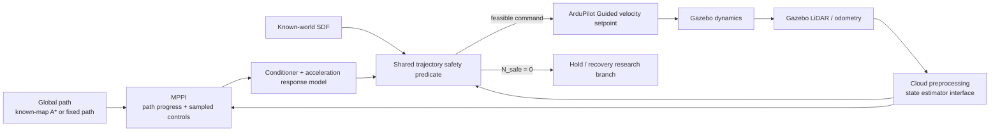

# MPPI UAV Navigation with ArduPilot and Gazebo

Nghiên cứu điều khiển UAV tránh vật cản bằng **Model Predictive Path Integral
(MPPI)** trên **ArduPilot SITL + Gazebo Harmonic**. Bài thử chính cho UAV lấy đà
60 m, đạt tốc độ cruise yêu cầu 5 hoặc 10 m/s, tự giảm tốc để qua các góc cua
trong bãi container rồi tăng tốc lại.

Repository chứa controller, mô hình dự đoán đáp ứng, kiểm tra quỹ đạo, world
Gazebo, harness chạy thí nghiệm, replay offline và tài liệu tái lập kết quả.
Các thành phần này là phần mở rộng nghiên cứu trên nền
[`ArduPilot/ardupilot_gazebo`](https://github.com/ArduPilot/ardupilot_gazebo).

## Trạng thái hiện tại

Profile tốt nhất hiện tại:
[`mppi_yard_progress_feasible80.yaml`](config/experiments/mppi_yard_progress_feasible80.yaml).

- Retiming tắt; global path chỉ cung cấp hình học.
- MPPI dùng path-progress objective và tự chọn profile tốc độ.
- `10 m/s` là cruise request và giới hạn trên, không phải tốc độ bắt buộc qua cua.
- Rollout dùng mô hình có acceleration memory và command conditioner.
- Cloud hiện tại và prior SDF cùng tham gia kiểm tra collision.
- Sample không an toàn bị loại trước MPPI weighting; gate cuối dùng cùng safety
  predicate.
- Headless 10 m/s, seed 7 và 17: **2/2 tới đích và LAND/disarm**, peak
  **8.98–9.19 m/s**, không optimizer timeout.

Hệ vẫn còn 11–21 chu kỳ `N_safe=0` trong hai lượt baseline và gửi zero hold.
Experiment 7A replay 1.600 lần cho thấy tăng 80 lên 640 random samples không tạo
được nghiệm ở 12 failure snapshots. Kết quả nghiêng về viability loss hoặc độ
nhạy của stopping model/margin, chưa chứng minh controller đã an toàn cho bay
thật.

Đọc trước khi đánh giá kết quả:

1. [Checkpoint mentor và kế hoạch phase tiếp theo](docs/MPPI_MENTOR_CHECKPOINT_AND_NEXT_PHASE_VI.md)
2. [Quickstart bài 5/10 m/s](docs/RUN_YARD_5_10_MS_QUICKSTART_VI.md)
3. [Feasibility mask và kết quả hai seed](docs/MPPI_FEASIBLE_SELECTION_VI.md)
4. [Kiểm chứng mô hình phanh và safety gate](docs/MPPI_MENTOR_SAFETY_PHASE_VI.md)
5. [Claim-to-source audit](docs/SOURCE_AUDIT.md)

## Kiến trúc



MPPI chạy trên companion side và gửi velocity/yaw-rate setpoint qua MAVLink.
ArduPilot giữ vai trò flight controller cấp thấp; Gazebo mô phỏng physics và
sensor. Đây là reduced closed-loop velocity model, không phải full rigid-body
reproduction của PA-MPPI.

## Chạy bài chuẩn

Yêu cầu đã được kiểm tra trong project:

- macOS, Gazebo Harmonic;
- ArduPilot tại `~/Projects/ardupilot`, đã build `build/sitl/bin/arducopter`;
- repository này tại `~/Projects/ardupilot_gazebo`;
- Python environment có `numpy`, `torch`, `PyYAML`, `pymavlink` và Gazebo Python
  bindings. Các lệnh dưới dùng environment
  `/opt/miniconda3/envs/ardupilot-rviz` của máy thí nghiệm.

Build plugin và world:

```bash
cd ~/Projects/ardupilot_gazebo
cmake -S . -B build -DCMAKE_BUILD_TYPE=RelWithDebInfo
cmake --build build -j4
/opt/miniconda3/envs/ardupilot-rviz/bin/python scripts/build_yard_runup60.py
```

Chạy headless, mỗi trial boot một Gazebo/SITL mới và tự takeoff, chạy planner,
LAND, lưu log:

```bash
cd ~/Projects/ardupilot_gazebo
PY=/opt/miniconda3/envs/ardupilot-rviz/bin/python

$PY scripts/run_yard_speed_ablation.py \
  --scenario yard-runup60 \
  --speeds 5 10 --seeds 7 \
  --config config/experiments/mppi_yard_progress_feasible80.yaml \
  --params config/experiments/mppi_yard_high_accel.parm \
  --timeout 90 \
  --output "output/benchmark/yard_$(date +%Y%m%d_%H%M%S)"
```

Thêm `--gui` và đổi sang
[`mppi_yard_progress_feasible80_gui.yaml`](config/experiments/mppi_yard_progress_feasible80_gui.yaml)
để xem Gazebo 3D. Không mở thêm RViz trong lượt đo tốc độ; camera/depth bridge và
sampled-trajectory visualization làm thay đổi tải realtime. Quy trình năm
terminal để quan sát và xử lý lỗi kết nối nằm trong
[quickstart](docs/RUN_YARD_5_10_MS_QUICKSTART_VI.md).

## Tái lập Experiment 7A

Thu exact planner snapshots ở hai seed:

```bash
PY=/opt/miniconda3/envs/ardupilot-rviz/bin/python

$PY scripts/run_yard_speed_ablation.py \
  --scenario yard-runup60 --speeds 10 --seeds 7 17 \
  --config config/experiments/mppi_yard_progress_feasible80.yaml \
  --params config/experiments/mppi_yard_high_accel.parm --timeout 60 \
  --debug-snapshot-events --debug-control-stride 20 \
  --output output/benchmark/yard_experiment7a_capture

$PY scripts/select_experiment7a_snapshots.py \
  output/benchmark/yard_experiment7a_capture \
  --output output/benchmark/yard_experiment7a_selection

$PY scripts/replay_experiment7a.py \
  output/benchmark/yard_experiment7a_selection \
  --samples 80 160 320 640 --realizations 20 \
  --output output/benchmark/yard_experiment7a_replay
```

Kết quả đã commit để đọc nhanh:

- [selection manifest](results/yard_experiment7a_20260916/manifest.json)
- [replay summary](results/yard_experiment7a_20260916/summary.json)
- [ESS/cost-gap analysis](results/yard_experiment7a_20260916/analysis.json)
- [1.600 solve records](results/yard_experiment7a_20260916/solves.csv)

## Kiểm thử

```bash
cd ~/Projects/ardupilot_gazebo
PYTEST_DISABLE_PLUGIN_AUTOLOAD=1 \
  /opt/miniconda3/envs/ardupilot-rviz/bin/python -m pytest -q tests
```

`PYTEST_DISABLE_PLUGIN_AUTOLOAD=1` tránh xung đột giữa pytest mới và ROS
`launch_testing` cài trong cùng environment. Unit tests kiểm tra frame/MAVLink,
A*, retiming, response model, stopping geometry, final trajectory gate,
feasibility weighting và proposal recovery. Test pass không thay thế kiểm chứng
closed-loop Gazebo.

## Bản đồ repository

| Đường dẫn | Nội dung |
|---|---|
| [`mppi_ardupilot/`](mppi_ardupilot/) | MPPI, response model, map geometry, safety predicate và MAVLink interface |
| [`scripts/mppi_velocity_avoidance.py`](scripts/mppi_velocity_avoidance.py) | Entry point planner live |
| [`scripts/run_yard_speed_ablation.py`](scripts/run_yard_speed_ablation.py) | Harness Gazebo/SITL cô lập, ghi log và cleanup |
| [`scripts/replay_experiment7a.py`](scripts/replay_experiment7a.py) | Replay sample-count/RNG trên exact snapshots |
| [`config/experiments/`](config/experiments/) | Profile controller; profile `feasible80` là baseline hiện tại |
| [`worlds/iris_mppi_yard_runup60.sdf`](worlds/iris_mppi_yard_runup60.sdf) | World bãi container với đoạn lấy đà 60 m |
| [`tests/`](tests/) | Regression tests cho controller, geometry và safety |
| [`docs/`](docs/) | Protocol, kết quả, giới hạn và lệnh tái lập |
| [`results/yard_experiment7a_20260916/`](results/yard_experiment7a_20260916/) | Kết quả gọn đã commit; raw Gazebo logs được giữ ngoài Git |

## Phạm vi kết luận

Kết quả hiện tại chỉ xác nhận hành vi trên Gazebo/ArduPilot SITL và các seed đã
nêu. `collision_radius_m=1.5` là center clearance chưa hiệu chuẩn thành rotor/
estimator envelope. Zero hold chưa phải verified emergency trajectory. Phase
tiếp theo là sensitivity test cho response, delay, horizon và margin, sau đó mới
chọn giữa hiệu chuẩn model và recursive-feasibility recovery.

Các mô tả liên quan paper được giới hạn theo
[`SOURCE_AUDIT.md`](docs/SOURCE_AUDIT.md). Tài liệu tham khảo nằm trong
[`reports/pa_mppi_sources.bib`](reports/pa_mppi_sources.bib).

## Nền tảng Gazebo plugin

Phần C++ plugin, model gimbal/sensor và các world gốc vẫn giữ tương thích với
upstream. Hướng dẫn kiểm tra SITL–Gazebo, transport topics và sensor threading
nằm tại [closed-loop runtime walkthrough](docs/closed_loop_runtime_walkthrough_vi.md).

Giấy phép: [BSD 3-Clause](LICENSE.md).
