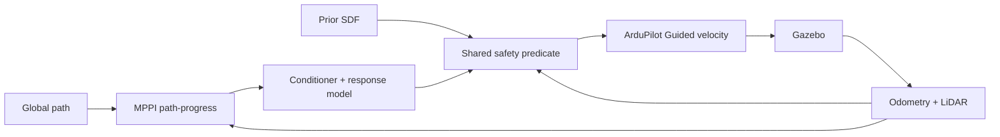

# MPPI UAV Navigation with ArduPilot and Gazebo

Project nghiên cứu điều khiển UAV tránh vật cản bằng **Model Predictive Path
Integral (MPPI)** trên **ArduPilot SITL + Gazebo Harmonic**. Bài thử chính cho
UAV lấy đà 60 m, đạt cruise request 5 hoặc 10 m/s, tự giảm tốc để qua các góc
cua trong bãi container rồi tăng tốc lại.

Kiến trúc C++/ROS 2 đề xuất cho edge deployment đang chờ mentor review tại
[`docs/ARCHITECTURE.md`](docs/ARCHITECTURE.md). Ba package bên dưới hiện chỉ là
interface/bringup skeleton; controller chạy thí nghiệm vẫn là bản Python.

Đây là phần mở rộng nghiên cứu trên nền
[`ArduPilot/ardupilot_gazebo`](https://github.com/ArduPilot/ardupilot_gazebo).
MPPI chạy trên companion side, gửi velocity/yaw-rate setpoint cho ArduPilot;
ArduPilot điều khiển UAV trong Gazebo.

## Trạng thái controller

Profile hiện dùng:
[`mppi_yard_progress_feasible80.yaml`](config/experiments/mppi_yard_progress_feasible80.yaml)
cho headless và
[`mppi_yard_progress_feasible80_gui.yaml`](config/experiments/mppi_yard_progress_feasible80_gui.yaml)
cho Gazebo GUI.

- Retiming tắt; global path chỉ cung cấp hình học.
- Objective gồm path tracking và path progress. `vmax` là giới hạn trên; MPPI
  được quyền tự giảm tốc trước cua.
- Rollout chứa command conditioner và mô hình đáp ứng có acceleration memory.
- Cloud hiện tại và prior SDF cùng tham gia kiểm tra collision.
- Sample không an toàn bị loại trước khi chuẩn hóa MPPI weight; output cuối dùng
  lại cùng safety predicate.



## Kết quả thí nghiệm hiện tại

| Thí nghiệm | Thiết lập | Kết quả | Kết luận |
|---|---|---|---|
| Cruise đường thẳng | Đường thoáng 300 m, path-progress, retiming tắt, hai seed | Giữ gần 10 m/s khoảng 22 s ở cả hai seed | Hệ có khả năng đạt cruise cao khi chưa gặp cua/vật cản |
| Phanh độc lập | 40 pha cruise→zero; 10 lần tại mỗi mức 4/6/8/10 m/s | Quãng dừng median lần lượt 4.00/7.81/13.48/20.10 m | Công thức `v×0.25 + v²/(2×3)` dự đoán thiếu ở 40/40 pha; thiếu lớn nhất 1.302 m tại 10 m/s |
| Feasible-selection headless 10 m/s | Yard run-up 60 m, 80 samples, seed 7/17 | 2/2 tới đích và LAND/disarm; peak 9.19/8.98 m/s; 21/11 cycle `N_safe=0`; 0 optimizer timeout | Đã sửa lỗi có safe sample nhưng output cuối không an toàn; chuyển động vẫn còn zero hold |
| Gazebo GUI | Seed 7, chạy riêng 5 và 10 m/s, không bật RViz | Cả hai tới đích; peak 4.98 và 8.68 m/s | Đủ để demo GUI, chưa chứng minh giữ ổn định 10 m/s trong yard |
| Experiment 7A | 12 failure + 8 control snapshots; K=80/160/320/640; 20 RNG/K; tổng 1.600 solve | Failure: `P_hit=0` ở mọi K. Control: `P_hit=1` ở mọi K | Tăng random samples không giải quyết `N_safe=0`; nguyên nhân hiện nghiêng về viability loss hoặc độ nhạy model/margin |

Các giới hạn cần giữ khi báo cáo:

- Hai seed thành công là checkpoint, chưa phải thống kê độ tin cậy.
- `collision_radius_m=1.5` là center clearance, chưa hiệu chuẩn thành rotor và
  estimator envelope.
- Zero setpoint khi `N_safe=0` chưa phải verified emergency trajectory.
- Kết quả chỉ áp dụng cho Gazebo/ArduPilot SITL, chưa phải chứng nhận bay thật.

Chi tiết số liệu và lập luận:

- [Checkpoint dành cho mentor](docs/MPPI_MENTOR_CHECKPOINT_AND_NEXT_PHASE_VI.md)
- [Feasibility-selection](docs/MPPI_FEASIBLE_SELECTION_VI.md)
- [Mô hình phanh và safety gate](docs/MPPI_MENTOR_SAFETY_PHASE_VI.md)
- [Kết quả Experiment 7A](results/yard_experiment7a_20260916/)
- [Claim-to-source audit](docs/SOURCE_AUDIT.md)

## Legacy Python validated baseline — Gazebo 3D bằng 5 terminal

> Đây là workflow hiện tại dùng để tái lập các kết quả đã báo cáo. Nó được giữ
> làm regression oracle trong quá trình port. Kiến trúc mục tiêu sẽ thay năm
> terminal bằng ROS 2 launch sau khi mentor review và chốt thiết kế.

Các lệnh gốc đã chạy trên macOS. Trên Ubuntu, đường dẫn Python/Gazebo có thể
khác; dùng Python environment đã cài `numpy`, `torch`, `PyYAML`, `pymavlink` và
Gazebo Python bindings. ArduPilot được giả định ở `~/Projects/ardupilot`, repo
này ở `~/Projects/ardupilot_gazebo`.

Chuẩn bị một lần:

```bash
cd ~/Projects/ardupilot_gazebo
cmake -S . -B build -DCMAKE_BUILD_TYPE=RelWithDebInfo
cmake --build build -j"$(nproc 2>/dev/null || sysctl -n hw.ncpu)"
python3 scripts/build_yard_runup60.py
```

### Terminal 1 — Gazebo server

```bash
cd ~/Projects/ardupilot_gazebo
export GZ_PARTITION=ardupilot_yard_5_10
export GZ_SIM_SYSTEM_PLUGIN_PATH="$PWD/build"
export GZ_SIM_RESOURCE_PATH="$PWD/models:$PWD/worlds"
gz sim -v2 -r "$PWD/worlds/iris_mppi_yard_runup60.sdf" -s
```

### Terminal 2 — Gazebo GUI

```bash
cd ~/Projects/ardupilot_gazebo
export GZ_PARTITION=ardupilot_yard_5_10
export GZ_SIM_RESOURCE_PATH="$PWD/models:$PWD/worlds"
gz sim -v1 -g --gui-config "$PWD/config/gazebo_runway_camera.config"
```

### Terminal 3 — ArduPilot SITL và MAVProxy

```bash
cd ~/Projects/ardupilot
python3 Tools/autotest/sim_vehicle.py \
  -v ArduCopter -f JSON -N -w \
  -A "--serial1=tcp:2" \
  --custom-location=-35.363262,149.165237,584,0 \
  --add-param-file="$HOME/Projects/ardupilot_gazebo/config/experiments/mppi_yard_high_accel.parm"
```

Đợi EKF sẵn sàng, sau đó nhập trong MAVProxy:

```text
mode guided
arm throttle
takeoff 5
```

Chờ UAV hover ổn định gần `(0,0,5)` trước khi chạy Terminal 5.

### Terminal 4 — ROS 2 bridge và RViz

```bash
cd ~/Projects/ardupilot_gazebo
export GZ_PARTITION=ardupilot_yard_5_10
export ROS_DOMAIN_ID=45
./scripts/run_sensor_rviz.sh
```

Terminal này dùng để quan sát camera, depth và trajectory. RViz làm tăng tải
realtime; nếu UAV bay chậm hoặc planner timeout, đóng Terminal 4 rồi chạy lại
để đánh giá controller. Kết quả benchmark trong bảng không bật RViz.

### Terminal 5 — MPPI planner

Chọn `YARD_SPEED=5` hoặc `YARD_SPEED=10`, và sửa `PYTHON` nếu environment nằm
ở đường dẫn khác:

```bash
cd ~/Projects/ardupilot_gazebo
export GZ_PARTITION=ardupilot_yard_5_10
export ROS_DOMAIN_ID=45

PYTHON=/opt/miniconda3/envs/ardupilot-rviz/bin/python
YARD_SPEED=10
YARD_SEED=7
RUN_TAG=$(date +%Y%m%d_%H%M%S)
mkdir -p output/log

MAVLINK20=1 "$PYTHON" scripts/mppi_velocity_avoidance.py \
  --planner mppi \
  --config config/experiments/mppi_yard_progress_feasible80_gui.yaml \
  --mav tcp:127.0.0.1:5762 \
  --goal '77.1,-1.9,5' \
  --global-path '0,0,5;60,0,5;60.5,-4,5;73,-4,5;77.1,-1.9,5' \
  --reference-speed-m-s "$YARD_SPEED" \
  --vmax "$YARD_SPEED" \
  --seed "$YARD_SEED" \
  --diag-every 20 \
  --diag-jsonl "output/log/yard_gui_v${YARD_SPEED}_seed${YARD_SEED}_${RUN_TAG}.jsonl" \
  --exit-on-goal
```

Planner thoát khi tới đích nhưng không tự LAND. Trong MAVProxy Terminal 3:

```text
mode land
```

Muốn đổi tốc độ, dừng cả phiên, khởi động lại năm terminal và cất cánh từ đầu.
Không chạy lượt 10 m/s ngay từ vị trí kết thúc của lượt 5 m/s.

Nếu UAV không cất cánh dù MAVProxy đã nhận lệnh, kiểm tra chỉ có một Gazebo
server và server đó đang giữ UDP 9002:

```bash
ps -axo pid,command | grep '[g]z sim -v2'
lsof -nP -iUDP:9002
```

## Bản đồ repository

| Đường dẫn | Nội dung |
|---|---|
| [`docs/ARCHITECTURE.md`](docs/ARCHITECTURE.md) | Kiến trúc C++/ROS 2 đề xuất, contracts, topics, failure policy và test plan |
| [`uav_navigation_core/`](uav_navigation_core/) | C++ types/interfaces thuần, chưa chứa thuật toán đã port |
| [`uav_navigation_ros/`](uav_navigation_ros/) | Skeleton ROS 2 adapters/nodes |
| [`uav_navigation_bringup/`](uav_navigation_bringup/) | Launch/config/RViz skeleton cho simulation và hardware |
| [`mppi_ardupilot/mppi_controller.py`](mppi_ardupilot/mppi_controller.py) | MPPI rollout, objective, proposal và weighting |
| [`mppi_ardupilot/mppi_local_planner_node.py`](mppi_ardupilot/mppi_local_planner_node.py) | Closed-loop planner, conditioner, gate và diagnostics |
| [`mppi_ardupilot/trajectory_safety.py`](mppi_ardupilot/trajectory_safety.py) | Safety predicate dùng chung cho sample và output cuối |
| [`mppi_ardupilot/braking.py`](mppi_ardupilot/braking.py) | Hình học stopping segment |
| [`mppi_ardupilot/known_geometry.py`](mppi_ardupilot/known_geometry.py) | Prior SDF từ world |
| [`mppi_ardupilot/global_planner.py`](mppi_ardupilot/global_planner.py) | Known-map 2.5D A* |
| [`scripts/mppi_velocity_avoidance.py`](scripts/mppi_velocity_avoidance.py) | Entry point planner live |
| [`scripts/run_yard_speed_ablation.py`](scripts/run_yard_speed_ablation.py) | Harness Gazebo/SITL tự động |
| [`scripts/replay_experiment7a.py`](scripts/replay_experiment7a.py) | Replay sample-count/RNG offline |
| [`config/experiments/`](config/experiments/) | Controller profiles và SITL parameters |
| [`worlds/iris_mppi_yard_runup60.sdf`](worlds/iris_mppi_yard_runup60.sdf) | World bãi container, đoạn lấy đà 60 m |
| [`tests/`](tests/) | Regression tests cho dynamics, geometry, selection và safety |
| [`docs/RUN_YARD_5_10_MS_QUICKSTART_VI.md`](docs/RUN_YARD_5_10_MS_QUICKSTART_VI.md) | Hướng dẫn chạy đầy đủ và troubleshooting |
| [`results/yard_experiment7a_20260916/`](results/yard_experiment7a_20260916/) | Manifest, summary, ESS analysis và 1.600 solve records |

Phần Gazebo plugin C++, model và world gốc vẫn giữ từ upstream. Luồng SITL,
Gazebo Transport và sensor được mô tả tại
[closed-loop runtime walkthrough](docs/closed_loop_runtime_walkthrough_vi.md).

Giấy phép: [LGPL-3.0](LICENSE.md).
