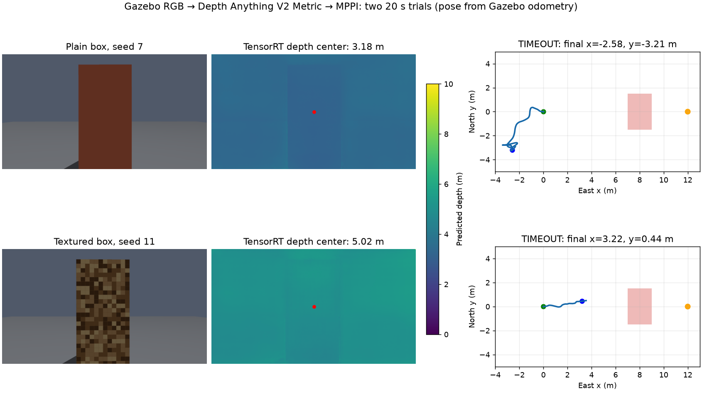

# Depth Anything + MPPI với dữ liệu Gazebo (9/10/2026)

Đã thử hai mức tích hợp. Trên Mac, Gazebo + ArduPilot SITL bay **closed-loop** với
ảnh RGB → Depth Anything V2 Metric Outdoor Small (PyTorch/MPS) → cloud → MPPI
Python → lệnh vận tốc. Trên Jetson Orin Nano, hai ảnh Gazebo đã ghi được phát
lại 10 Hz qua **node depth TensorRT C++ và node MPPI C++ trong Docker**. Phép
thử Orin chỉ quan sát lệnh, không nối adapter ArduPilot nên chưa chứng minh bay
closed-loop bằng runtime C++.



## Dữ liệu và kết quả bay Gazebo

Hai lượt đều dùng camera RGB 640×360, không có LiDAR/depth camera, mục tiêu
`(12, 0, 3)` m, hộp chắn đường có mặt trước tại `x=7` m, MPPI giới hạn
`1 m/s`, thời hạn 20 giây. Pose cho perception/planner là **Gazebo odometry**;
đây không phải định vị chỉ bằng camera. Hình học hộp chỉ dùng để chấm sau
thí nghiệm, không đưa vào perception/planner. Cấu hình:
[`config/monocular_mppi.yaml`](../config/monocular_mppi.yaml),
[`config/monocular_depth_mppi_capture.json`](../config/monocular_depth_mppi_capture.json).

| World, seed | Cloud RGB → depth | Chu kỳ lệnh MPPI | Kết quả sau 20 s | Clearance hộp nhỏ nhất* | RGB → publish p95 khi điều khiển |
| --- | ---: | ---: | --- | ---: | ---: |
| Hộp trơn, 7 | 402 | 190 | `TIMEOUT`, cuối `(-2.58, -3.21, 3.13)` m, cách đích 14.93 m | 6.99 m | 71.9 ms |
| Hộp có texture, 11 | 371 | 131 (130 lệnh, 1 hold) | `TIMEOUT`, cuối `(3.22, 0.44, 3.25)` m, cách đích 8.79 m | 3.78 m | 110.9 ms |

\* Clearance là khoảng cách tới bề mặt hộp trừ bán kính proxy UAV 0.5 m,
không phải phép đo va chạm vật lý. Cả hai lượt không chạm hộp theo proxy;
cả hai cũng **không tới đích** trong thời gian thử. Ở lượt texture, lệnh đầu
tiên xuất hiện muộn khoảng 8.2 s sau mốc bắt đầu planner, nên không thể kết
luận chỉ từ 20 s rằng planner sẽ không bao giờ tới đích. Lượt hộp trơn đi
lùi/sang ngang; lượt texture tiến được khoảng 3.2 m. Không có cơ sở nâng lên
5–10 m/s.

Ảnh ở đúng lúc planner bắt đầu cho phép đối chiếu depth với hình học Gazebo:
camera cách mặt trước hộp xấp xỉ **6.87 m** (tâm UAV tới mặt hộp ~7.04 m,
trừ offset camera ~0.17 m). Tại pixel giữa hộp, TensorRT C++ trên Orin dự đoán
**3.18 m** cho hộp trơn và **5.02 m** cho hộp texture; kết quả PyTorch/MPS trên
Mac tương ứng **3.18 m** và **5.02 m**. Đây là sai số thiếu khoảng **3.69 m**
và **1.85 m** ở hai ảnh, không phải sai khác backend. So sánh một pixel với
hình học hộp chưa thay thế benchmark độ sâu toàn ảnh, nhưng đủ chỉ ra cloud
đang đặt vật cản gần hơn thực tế trong hai ảnh này. Việc chỉnh MPPI đơn thuần
sẽ khó giải quyết sai số perception đó.

Log gọn trên Mac:
`results/monocular_research/depth_mppi_gazebo_20261009_seed7/` và
`results/monocular_research/depth_mppi_textured_20261009_seed11/`.
RGB/depth snapshot đầy đủ đã chuyển sang Orin tại
`/home/nvidia/uav_deploy/gazebo_trials/{tên_trial}/perception/` để không làm
đầy ổ Mac. Hai frame dùng so backend được lưu trong
[`artifacts/orin_depth_mppi_samples/`](../artifacts/orin_depth_mppi_samples/):
`planner_start.rgb` gồm 2×640×360 RGB8 nối tiếp, `poses.f32` gồm 2×XYZ
float32 little-endian, `depth_sequence.f32` gồm 2×360×640 float32 little-endian;
[`samples.json`](../artifacts/orin_depth_mppi_samples/samples.json) ghi frame
và pose. [`trial_metrics.json`](../artifacts/orin_depth_mppi_samples/trial_metrics.json)
và [`planner_positions.json`](../artifacts/orin_depth_mppi_samples/planner_positions.json)
giữ số liệu và đường bay cho hình trên. Các file nhị phân mẫu chỉ là hai
snapshot, không phải cả video.

## Kiểm tra chuỗi C++ trên Orin trong Docker

Image riêng `uav-monocular:humble-gpu-shadow` được build trên Orin từ
[`docker/Dockerfile.humble-gpu`](../docker/Dockerfile.humble-gpu). Script
[`scripts/run_cpp_depth_mppi_shadow_orin.sh`](../scripts/run_cpp_depth_mppi_shadow_orin.sh)
khởi động hai container tạm thời cho depth và MPPI trên `ROS_DOMAIN_ID=74`,
rồi phát mỗi ảnh Gazebo với pose tương ứng ở 10 Hz bằng executable
[`rgb_depth_mppi_shadow.cpp`](../uav_navigation_ros/test/rgb_depth_mppi_shadow.cpp).
Container dùng filesystem chỉ đọc, mount engine TensorRT và mẫu ở chế độ chỉ
đọc, `--rm`, và tự dừng khi script kết thúc. Không cài ROS/Gazebo vào host;
image depth đang chạy ở domain 73 được giữ nguyên.
Trong lúc nối thử đã sửa cấu hình C++: `max_speed_xy_m_s=1.0` trước đây xung
đột với giá trị mặc định `turn_speed_m_s=3.0`, khiến node MPPI từ chối khởi
động. [`monocular.yaml`](../uav_navigation_bringup/config/monocular.yaml)
giờ đặt tường minh các ngưỡng speed shaping tương thích với giới hạn 1 m/s.

Lượt xác nhận sau khi build (80 ảnh phát mỗi cảnh):

| Cảnh | Khoảng phát p50/p95 | Cloud nhận | Depth diagnostic OK | MPPI `ACTIVE` | Lệnh nhận |
| --- | ---: | ---: | ---: | ---: | ---: |
| Hộp trơn | 100.07 / 100.66 ms | 68 | 68 | 80 | 80 |
| Hộp texture | 99.97 / 100.76 ms | 75 | 75 | 81 | 81 |

Số `ACTIVE` và số lệnh có thể hơn số frame do planner chạy timer 10 Hz riêng.
Khoảng 5–12 ảnh không thành cloud trong cửa sổ quan sát 80 frame, và có vài
chu kỳ `HOLD_STALE`/chờ đầu vào; chưa đo toàn bộ trễ từ ảnh tới lệnh. Bài thử
phát lặp lại **một frame và pose cố định của mỗi cảnh**, nên chỉ xác nhận
message wiring, nhịp phát và việc MPPI nhận cloud rồi tạo lệnh. Nó không kiểm
tra hành vi tránh vật khi UAV di chuyển, sai số định vị, hay adapter/autopilot.

Để chạy lại trên Orin (không đổi image depth đang dùng):

```bash
cd ~/ardu_plugin_gazebo
docker build --platform linux/arm64 -f docker/Dockerfile.humble-gpu \
  -t uav-monocular:humble-gpu-shadow .
ROS_DOMAIN_ID=74 UAV_DEPTH_ENGINE=/home/nvidia/uav_deploy/depth_fp16.plan \
  bash scripts/run_cpp_depth_mppi_shadow_orin.sh
```

Để tái tạo hai lượt closed-loop trên máy có Gazebo/ArduPilot SITL và MPS, dùng
`scripts/run_monocular_sim.py` với `--world` là
`worlds/iris_monocular_obstacle.sdf` (seed 7) hoặc
`worlds/iris_monocular_textured.sdf` (seed 11), cùng
`--config config/monocular_mppi.yaml`,
`--perception-config config/monocular_depth_mppi_capture.json`,
`--goal 12 0 3 --duration 20 --depth-device mps` và `--output` khác nhau.
Các lệnh con và hash cấu hình thực tế nằm trong `*.command.json`/`manifest.json`
ở từng thư mục log.

Vấn đề ưu tiên tiếp theo là đánh giá độ sâu trên nhiều khoảng cách/texture,
lọc cloud theo độ tin cậy rồi đánh giá lại hành vi MPPI bằng chuỗi frame động.
Sau đó mới nối đầy đủ camera Gazebo → TensorRT C++ → MPPI C++ → adapter
ArduPilot trong Docker và chạy nhiều seed. Hiện **chưa có vận tốc an toàn
được chứng minh** cho cấu hình này.
