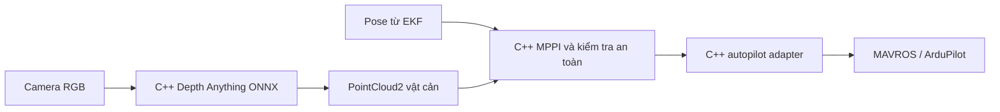

# Đường chạy monocular C++ để chuẩn bị cho Jetson Nano

Ngày 06/10/2026. Repo đã có các thành phần C++ cho đường xử lý dự kiến trên
UAV: node mới đọc RGB, chạy Depth Anything V2 Metric Outdoor
Small từ ONNX, phát point cloud; node điều hướng dùng MPPI C++ sẵn có; adapter
C++ chuyển lệnh an toàn sang MAVROS/ArduPilot. Launch monocular hiện chỉ là
thử nghiệm perception: global planner tắt nên phải có path hợp lệ từ nguồn
khác trước khi MPPI tạo lệnh; adapter cũng tắt mặc định. Các script Python cũ vẫn dùng
để xuất model, chạy thí nghiệm và chấm kết quả **trên máy phát triển**; chúng
không được cài vào gói `uav_navigation_bringup` để bay.



MPPI C++ vốn đã nằm trong [`uav_navigation_core`](../uav_navigation_core/) và
[`local_navigation_node.cpp`](../uav_navigation_ros/src/local_navigation_node.cpp).
Phần mới là [tiền xử lý ảnh và đổi depth thành điểm 3D](../uav_navigation_core/src/metric_depth.cpp),
[suy luận ONNX bằng OpenCV DNN](../uav_navigation_ros/src/depth_anything_onnx.cpp)
và [node camera ROS 2](../uav_navigation_ros/src/monocular_depth_node.cpp).
Hai launch [monocular sim](../uav_navigation_bringup/launch/monocular_sim.launch.xml)
và [monocular shadow](../uav_navigation_bringup/launch/monocular_shadow.launch.xml)
đã bỏ lệnh gọi Python. Launch sim tắt cầu LiDAR; launch shadow phát cloud vào
topic riêng để không thay đầu vào LiDAR của planner. Adapter bay vẫn tắt
mặc định trong monocular sim.

## Tình trạng thay thế Python

| Phần chạy | Tình trạng C++ | Quyết định hiện tại |
| --- | --- | --- |
| MPPI, kiểm tra quỹ đạo, adapter ArduPilot | Đã có C++ và test; ROS launch dùng C++ | Python MPPI chỉ giữ cho thí nghiệm cũ và đối chiếu |
| Depth Anything từ RGB | ONNX C++ khớp depth Python, nhưng OpenCV CPU trên Mac chỉ 1,27 ảnh/s | Chưa xóa predictor Python trước khi đo backend trên Jetson đạt deadline |
| Gate cloud cho planner | C++ ngừng phát lệnh mới khi ít hơn 12 điểm hợp lệ hoặc timestamp nguồn quá cũ trong profile monocular | Đã chuyển điều kiện kiểm tra này sang đường ROS 2 |
| Landmark nhiều frame, map free/unknown, pose từ ảnh/IMU | Chưa có đường C++ tương đương nối vào planner | Chưa thể thay runner nghiên cứu Python hoặc tuyên bố bay chỉ bằng camera |

Smoke test ROS 2 với MPPI C++ xác nhận cloud 3 điểm cho
`WAITING_FOR_OBSTACLES`, cloud 20 điểm có timestamp cũ 5 giây cho
`HOLD_STALE`; cả hai trường hợp đều không phát lệnh. Cấu hình LiDAR cũ giữ
giá trị mặc định 0 cho hai gate mới; profile monocular đặt 12 điểm và 0,5 giây.

Chỉ bỏ runner `.py` trên đường bay khi bản C++ chạy đủ tốc độ trên Jetson,
phát cloud đúng frame/timestamp, có các đầu vào map/pose cần dùng, và vượt
kiểm thử closed-loop nhiều lượt ở 0,5 rồi 1 m/s. Các script xuất model và
đánh giá offline vẫn được giữ trên máy phát triển; runner cũ là bản đối chiếu
cho tới khi các gate này đạt.

Model ONNX không được đưa vào Git vì file khoảng 98 MB. Xuất một lần trên máy
phát triển bằng [script xuất model](../scripts/export_depth_anything_onnx.py):

```bash
python3 scripts/export_depth_anything_onnx.py \
  --output results/monocular_research/depth_anything_v2_metric_outdoor_small_294x518_fixedpos.onnx
```

Model giữ đúng checkpoint trong [benchmark LiDAR](MONOCULAR_MENTOR_DEPTH_BENCHMARK_VI.md),
nhận tensor `1×3×294×518` từ camera 640×360; phép nội suy positional embedding
đã tính sẵn cho kích thước cố định này. [Metadata và SHA-256](mentor_depth_evidence/cpp/model_export.json)
cho phép kiểm tra file đã chép sang Jetson. Python/PyTorch chỉ tham gia **xuất
model offline**; node bay chỉ cần ROS 2, C++ và OpenCV DNN có khả năng đọc
graph ONNX này.

Sau khi build các gói ROS 2 và đặt file ONNX trên máy chạy, lệnh mô phỏng là:

```bash
ros2 launch uav_navigation_bringup monocular_sim.launch.xml \
  model_file:=/duong/dan/depth_anything_v2_metric_outdoor_small_294x518_fixedpos.onnx \
  depth_backend:=cpu enable_gazebo_gui:=false enable_rviz:=false
```

`depth_backend` còn nhận `cuda` và `cuda_fp16` **chỉ khi** bản OpenCV DNN trên
máy có target tương ứng. Node sẽ báo lỗi nếu yêu cầu CUDA mà OpenCV không hỗ
trợ, thay vì âm thầm dùng CPU. Trên Jetson phải kiểm tra việc import ONNX và
đo lại CPU, RAM, độ trễ, frame bị bỏ và tuổi ảnh với model/backend thực tế;
số đo trên Mac không dự báo được tốc độ của Nano.

## Đã kiểm tra trên máy phát triển

- Tiền xử lý C++ khớp **từng giá trị tensor** với processor Hugging Face trên
  ảnh RGB 640×360 đã lưu. Phần resize dùng cùng cách bicubic có lọc khi giảm
  kích thước; resize trực tiếp bằng OpenCV đã gây sai khác depth đáng kể.
- [Ba ảnh từ chuyến benchmark](mentor_depth_evidence/cpp/parity_20261006.json)
  cho depth C++ so với depth Python MPS sai trung bình theo frame
  **0,0000166 m**; sai khác pixel lớn nhất **0,000824 m**. Đây là kiểm tra
  **port phần mềm**, không phải độ chính xác so với vật thật/LiDAR.
- Node C++ đã build cùng MPPI và adapter C++. Smoke test ROS 2 với một ảnh
  có timestamp/frame hợp lệ cho ra cloud **1.887 điểm** khi tạm nới cả
  deadline suy luận lẫn tổng xử lý lên 1000 ms để kiểm tra đường dữ liệu.
- [Đo lại trên MacBook Air M2](mentor_depth_evidence/cpp/cpu_reference_20261006.json):
  OpenCV DNN **CPU** với một luồng mất p50 **791 ms**,
  p95 **804 ms** cho 20 lần lặp cùng ảnh, chỉ khoảng **1,27 ảnh/s** và dùng
  gần **100% một lõi CPU**. Với deadline 100 ms cho suy luận và toàn bộ xử lý,
  node **không phát
  cloud trễ**; smoke test ghi diagnostic khoảng 833 ms. Phép đo riêng này gồm
  tiền xử lý, suy luận và phóng ảnh depth, chưa gồm truyền ROS và tạo cloud.
  Đây là hiệu năng
  riêng của OpenCV 5 CPU trên Mac, không phải kết quả Jetson.

Model depth gốc vẫn có MAE khoảng 1,45 m trong scene LiDAR mô phỏng. Planner
hiện nhận **điểm occupied**, chưa có bằng chứng vùng nào là free hay unknown;
vì thế chưa có cơ sở cho bay tránh vật tự động. Đường C++ cũng chưa được chạy
end-to-end trên Jetson Nano, chưa kiểm tra OpenCV/TensorRT của đúng image hệ
điều hành Jetson, và mô phỏng hiện vẫn lấy odometry từ Gazebo cho planner.
Trước khi bật adapter để bay, cần nối pose EKF thực, xác nhận phép biến đổi
tọa độ camera, xử lý unknown/free và vượt gate độ trễ/độ chính xác trên nhiều
scene. Việc chuyển sang C++ **không tự sửa sai số depth hay bảo đảm 10 Hz**.
